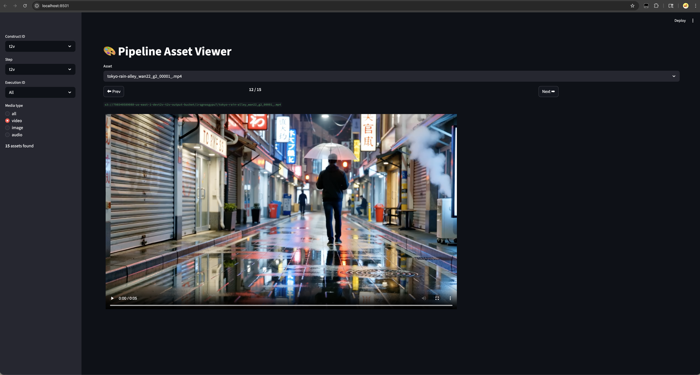

<h1 align="center">SageMaker Media Generation Pipelines</h1>
<p align="center">A Modular Media Generation & Evaluation Framework</p>

<p align="center">
  
  
  
  
  
  
  
  
  
</p>

A config-driven, modular framework for high-volume batch media generation and evaluation across video, image, and audio modalities using AWS SageMaker Pipelines. Built for scale — pipelines automatically shard work across multiple GPU instances in parallel, processing thousands of prompts per run. Each pipeline is defined entirely by a YAML config file. New pipelines and steps are added via YAML + a container directory, with zero CDK code changes. All generation steps use a headless ComfyUI as the inference backend, with automated quality evaluation (VBench), human-in-the-loop review (A2I), and per-asset DynamoDB tracking.

## Supported Modalities

| Modality | Type | Model(s) |
|---|---|---|
| Video | Text-to-Video (T2V) | [Wan 2.2](https://huggingface.co/Comfy-Org/Wan_2.2_ComfyUI_Repackaged) |
| Video | Image-to-Video (I2V) | [Wan 2.2](https://huggingface.co/Comfy-Org/Wan_2.2_ComfyUI_Repackaged) |
| Video | First-Last-Frame-to-Video (FLF2V) | [Wan 2.2 FLF](https://huggingface.co/Comfy-Org/Wan_2.2_ComfyUI_Repackaged) |
| Image | Text-to-Image (T2I) | [Z-Image-Turbo](https://huggingface.co/Comfy-Org/z_image_turbo) |
| Audio | Text-to-Audio (T2A) | [ACE Step 1.5 Turbo AIO](https://huggingface.co/Comfy-Org/ace_step_1.5_ComfyUI_files) |
| Captioning | Image Captioning | [Qwen2.5-VL-7B-Instruct](https://huggingface.co/Qwen/Qwen2.5-VL-7B-Instruct) |

| Config File | Modality | Steps | Models | A2I Review |
|---|---|---|---|---|
| [`config_vrag.yaml`](docs/USECASES.md#v-rag-pipeline-config_vragyaml) | Video (I2V) | 6 | Wan 2.2 I2V, VBench | Yes (video) |
| [`config_i2v.yaml`](docs/USECASES.md#image-to-video-config_i2vyaml) | Video (I2V) | 3 | Wan 2.2 I2V, VBench | Yes (video) |
| [`config_motionart.yaml`](docs/USECASES.md#motionart-transitions-config_motionartyaml) | Video (FLF2V) | 3 | Qwen2.5-VL-7B-Instruct, Wan 2.2 I2V, VBench | Yes (video) |
| [`config_t2a.yaml`](docs/USECASES.md#text-to-audio-config_t2ayaml) | Audio | 2 | ACE Step 1.5 Turbo AIO | Yes (audio) |
| [`config_t2i.yaml`](docs/USECASES.md#text-to-image-config_t2iyaml) | Image | 2 | Z-Image-Turbo | Yes (image) |
| [`config_t2v.yaml`](docs/USECASES.md#text-to-video-config_t2vyaml) | Video (T2V) | 3 | Wan 2.2 T2V, VBench | Yes (video) |


See [Pipeline Use Cases](docs/USECASES.md) for per-pipeline DAGs, step details, and when to use each config.

## Architecture

Stack dependency overview. See [infrastructure/README.md](infrastructure/README.md) for the full detailed architecture diagram.


## Framework Building Blocks

| Component | Description | Details |
|---|---|---|
| CDK Stacks | 6 stacks with explicit dependency ordering | [infrastructure/README.md](infrastructure/README.md) |
| Reusable Constructs | L3 constructs with pre-built IAM policies and security defaults | [project_constructs/README.md](project_constructs/README.md) |
| Containers | One Docker container per pipeline step | [processing_job/README.md](processing_job/README.md) |
| Lambdas | Pipeline triggers, A2I review, retrieval, and build orchestration | [lambdas/README.md](lambdas/README.md) |

## Documentation

| Document | Description |
|---|---|
| [Config Authoring Guide](docs/CONFIG_GUIDE.md) | How to create and customize pipeline config YAMLs |
| [Operations Guide](docs/OPERATIONS.md) | Deploy, trigger, monitor, A2I review, and troubleshooting |
| [V-RAG Operations](docs/OPERATIONS.md#v-rag-pipeline) | V-RAG pipeline setup, dataset ingestion, and retrieval operations |
| [Extending the Framework](docs/EXTENDING.md) | Add steps, pipelines, containers, tests, and data model |
| [Pipeline Use Cases](docs/USECASES.md) | Per-pipeline use cases, DAGs, models, and when to use each config |
| [ComfyUI Containers](docs/COMFYUI_CONTAINERS.md) | Running ComfyUI workflows as headless batch jobs |

## Prerequisites

- Python 3.13+
- AWS CDK v2
- AWS CLI configured
- [`uv`](https://docs.astral.sh/uv/) package manager

### SageMaker Service Quotas

Request these increases via the [AWS Service Quotas console](https://console.aws.amazon.com/servicequotas/) before deploying:

| Service | Quota Name |
|---|---|
| Amazon SageMaker | Number of instances across all processing jobs |
| Amazon SageMaker | Maximum number of instances per processing job |
| Amazon SageMaker | ml.g5.xlarge for processing job usage |

> **Cost note:** SageMaker processing jobs incur costs while running. For testing, reduce `InstanceCount` in your pipeline config to lower instance counts. See [SageMaker pricing](https://aws.amazon.com/sagemaker/pricing/) for details.

## Getting Started

1. **Clone and setup:**
   ```bash
   git clone https://github.com/aws-samples/sample-sagemaker-media-generation-pipelines.git && cd sample-sagemaker-media-generation-pipelines
   make setup
   ```

2. **Configure environment:**
   ```bash
   cp .env.example .env
   # Edit .env with your AWS_ACCOUNT_ID and REGION
   ```

3. **CDK bootstrap** (one-time per account/region):
   ```bash
   make bootstrap
   ```

4. **Run pre-commit checks:**
   ```bash
   make lint
   ```

5. **Run unit tests:**
   ```bash
   make test
   ```

6. **Deploy:**
   ```bash
   make deploy
   ```
   > `make deploy` runs `lint` and `test` as prerequisites before deploying. See the [Operations Guide](docs/OPERATIONS.md) for post-deploy steps (container builds, model downloads), triggering pipelines, monitoring, and troubleshooting.

7. **Destroy (tear down all stacks):**
   ```bash
   make destroy
   ```
   This loops through every pipeline config in `cicd.yaml` and runs `cdk destroy --all` for each, ensuring all per-config stacks (DataStack, A2IStack, PipelineStack) and shared stacks (SecurityStack, CodeBuildStack, CiCdPipelineStack, ContainerPipelineStack) are removed.

> **Windows users:** The `Makefile` requires `make` (install via [chocolatey](https://community.chocolatey.org/packages/make), [scoop](https://scoop.sh/), or use WSL). Alternatively, run the underlying commands directly — see the `Makefile` for the full list. All commands use `uv run` which handles the virtual environment automatically without manual activation.

## Operations

For post-deploy steps, triggering pipelines, monitoring, A2I human review, and troubleshooting, see the [Operations Guide](docs/OPERATIONS.md).

## Sample Outputs

Example assets generated by the framework:

**Text-to-Video (T2V)** — *"A slow cinematic tracking shot down a rain-soaked Tokyo alleyway at night"*


**Image-to-Video (I2V)** — Generated from a reference image


**Text-to-Image (T2I)** — *"A slow cinematic tracking shot down a rain-soaked Tokyo alleyway at night"*


**Text-to-Audio (T2A)** — *Neo-Soul groove track*

[🎵 Listen to sample](assets/samples/t2a_neo_soul_groove.mp3)

### Media Viewer

Browse all generated assets locally with the Streamlit viewer:

```bash
make view
```



## Acknowledgements

This project uses the following open-source projects:

| Project | License | Usage |
|---|---|---|
| [ComfyUI](https://github.com/comfyanonymous/ComfyUI) | GPL-3.0 | Inference backend for all generation steps (t2v, i2v, t2i, t2a, flf2v) |
| [ComfyScript](https://github.com/Chaoses-Ib/ComfyScript) | MIT | Python scripting interface for ComfyUI workflows |
| [VBench](https://github.com/Vchitect/VBench) | Apache-2.0 | Video quality evaluation across 10 automated dimensions |
| [DINO](https://github.com/facebookresearch/dino) | Apache-2.0 | Self-supervised vision model used by VBench for subject_consistency |
| [Unsplash Lite](https://github.com/unsplash/datasets) | Unsplash License | Image dataset source for retrieval pipeline seeding |
| [Open Images V7](https://storage.googleapis.com/openimages) | CC BY 4.0 | Image dataset source (alternative to Unsplash) |


Third-party dependencies are installed at container build time and are subject to their own license terms.

## Security

See [CONTRIBUTING](CONTRIBUTING.md#security-issue-notifications) for more information.

## License

This project is licensed under the Apache-2.0 License.