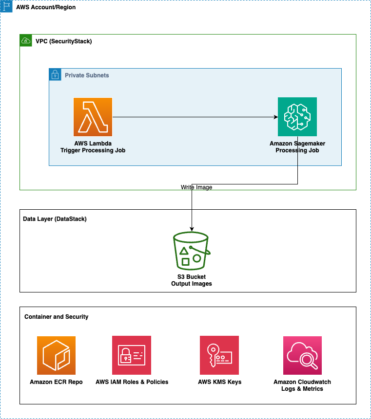

# ComfyUI on SageMaker Processing Job

This project deploys AWS infrastructure for running ComfyUI workflows on SageMaker Processing Jobs. The solution provides a scalable, cost-effective way to run ComfyUI workflows in the cloud with automatic resource management.

## Architecture Overview

The project consists of three main CDK stacks:

1. **SecurityStack** - IAM roles and security configurations
2. **DataStack** - S3 buckets for input and output storage  
3. **ComfyUiStack** - SageMaker Processing Job with Lambda trigger

### Key Components

- **SageMaker Processing Job**: Runs ComfyUI on `ml.g5.xlarge` instances with GPU acceleration
- **Lambda Function**: Manual trigger for processing job
- **S3 Buckets**: Input and output storage for generated content
- **Docker Container**: Custom CUDA-enabled container (see `processing_job/` directory)
- **CDK Infrastructure**: Automated deployment and resource management

## Prerequisites
- Python 3.13+
- AWS CLI configured
- Docker (for building container images)
- AWS CDK v2
- CDK bootstrapped in your target AWS account and region

## Setup

### 1. Environment Configuration

Create your environment file:
```bash
cp .env.example .env
```

Edit `.env` with your AWS account details:
```
AWS_ACCOUNT_ID=your-account-id
REGION=us-east-1
```

### 2. Install Dependencies

This project uses `uv` for dependency management:
```bash
# Install uv if you haven't already
curl -LsSf https://astral.sh/uv/install.sh | sh

# Create environment
uv venv --python 3.13

# Activate Environment
source .venv/bin/activate

# Install dependencies
uv sync
```

Alternatively, using pip:
```bash
pip install -r requirements.txt
```

### 3. CDK Bootstrap

Bootstrap CDK in your target AWS account and region (required for CDK deployments):
```bash
cdk bootstrap aws://YOUR-ACCOUNT-ID/YOUR-REGION
```

For example:
```bash
cdk bootstrap aws://123456789012/us-east-1
```

### 4. ECR Authentication

Log in to the AWS ECR registry for the PyTorch base image:
```bash
aws ecr get-login-password --region us-east-1 | docker login --username AWS --password-stdin 763104351884.dkr.ecr.us-east-1.amazonaws.com
```

### 5. Service Quota Request

Request a service quota increase for `ml.g5.xlarge` in SageMaker processing jobs through the AWS console.

## Configuration

The processing job configuration is defined in `config/config.yaml`:

- **Instance Type**: `ml.g5.xlarge` (GPU-enabled)
- **Instance Count**: 1
- **Volume Size**: 125GB
- **Container**: Custom ComfyUI Docker image

## Deployment

### Deploy all stacks:
```bash
cdk deploy --all --require-approval never
```

### Deploy individual stacks:
```bash
cdk deploy SecurityStack
cdk deploy DataStack
cdk deploy ComfyUiStack
```

## Triggering the Processing Job

Once deployed, you can trigger processing job through the **lambda function** created with the cdk code called `ComfyUiSmStack-ProcessingJob-Trigger-ComfyUI-trigger-Lambda`.

## Processing Job Outputs
Once the processing job completes, all the outputs will be stored in the S3 bucket created from this application.

## Solution Architecture



## Project Structure

```
├── app.py                          # Main CDK application
├── assets/                         # README assets
├── config/
│   ├── config.py                   # Configuration loader
│   └── config.yaml                 # Processing job configuration
├── infrastructure/
│   ├── data.py                     # S3 buckets and data resources
│   ├── security.py                 # IAM roles and policies
│   └── comfyui.py                  # Main ComfyUI stack
├── project_constructs/
│   ├── processing_job/
│   │   ├── main.py                 # Processing job construct
│   │   └── model.py                # Data models for processing job
│   ├── lambda_function.py          # Lambda construct
│   └── s3.py                       # S3 bucket construct
├── processing_job/                 # Container and workflow scripts (see processing_job/README.md)
│   ├── Dockerfile                  # CUDA-enabled container definition
│   ├── run_job.sh                  # Main processing script
│   ├── run_workflow.py             # Individual workflow runner
│   ├── is_queue_empty.py           # Queue monitoring script
│   ├── image_z_image_turbo.json    # Example ComfyUI workflow
│   ├── prompts.txt                 # Example prompt file
│   └── README.md                   # Detailed container and workflow documentation
├── lambdas/
│   └── trigger_processing_job/     # Lambda function code
└── requirements.txt                # Python dependencies
```


## Monitoring and Troubleshooting

- **CloudWatch Logs**: Check SageMaker Processing Job logs
- **Lambda Logs**: Monitor function execution in CloudWatch
- **S3 Monitoring**: Review bucket contents for input/output files
- **CDK Nag**: Security and best practice compliance checking

### Common Issues

1. **Container build failures**: Ensure Docker is running and ECR authentication is complete
2. **Processing job failures**: Check CloudWatch logs for detailed error messages
3. **Permission errors**: Verify IAM roles have necessary permissions

## Cost Considerations

- `ml.g5.xlarge` instances are GPU-enabled and cost ~$1.41/hour
- Processing jobs are billed per second with a 1-minute minimum
- Monitor usage through AWS Cost Explorer

## Security Features

- **IAM Roles**: Least privilege access principles
- **VPC Configuration**: Network isolation for processing jobs
- **CDK Nag Integration**: Automated security compliance checking
- **Encrypted Storage**: S3 buckets with encryption at rest


## Development

### Customizing Infrastructure

Edit `config/config.yaml` to change:
- Instance type (ensure GPU compatibility for ComfyUI)
- Volume size
- Instance count for parallel processing

### Container Development

For container customization, workflow development, and detailed usage instructions, see [processing_job/README.md](processing_job/README.md).

## Clean Up

To avoid unnecessary costs, destroy all resources:
```bash
cdk destroy --all
```

This will remove all AWS resources created by the CDK stacks.