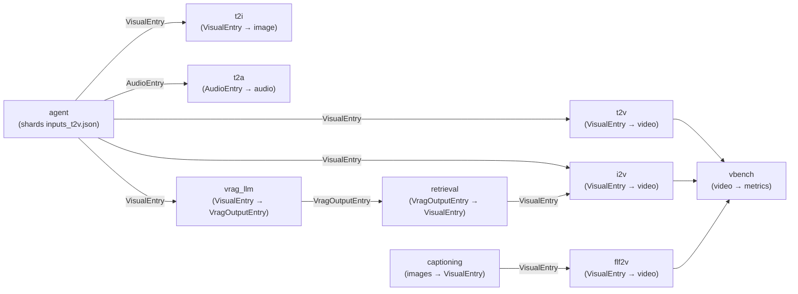

# Extending the Framework

How to add new pipeline steps, new pipelines, new containers, and tests to the framework — all without modifying CDK code.

> **Navigation:** [← Main README](../README.md) | [Config Guide](CONFIG_GUIDE.md) | [Use Cases](USECASES.md) | [Operations](OPERATIONS.md)

---

## Adding a New Step

Adding a new processing step to an existing pipeline requires zero CDK code changes:

1. **Add a YAML config entry** — Add the step to `steps:` in the pipeline config (`config/pipeline/*.yaml`) with instance type, count, volume, entrypoint, arguments, and optional `models_prefix`:

   ```yaml
   steps:
     my_new_step:
       InstanceCount: 1
       InstanceType: ml.g5.xlarge
       VolumeSizeInGB: 50
       ContainerEntrypoint: ["python3", "main.py"]
       ContainerArguments: ["--generate"]
       models_prefix: ["my_model"]
   ```

2. **Create a container directory** — Create `processing_job/my_new_step/` with at minimum:
   - `Dockerfile` — container image definition
   - `main.py` — step entrypoint
   - Optional `requirements.txt` for step-specific dependencies
   - Optional imports from `processing_job/common/`

3. **Wire the pipeline graph** — Add the step to `pipeline_graph:` with its dependencies:

   ```yaml
   pipeline_graph:
     my_new_step: ["agent"]  # runs after agent step
   ```

4. **Optional: Add A2I human review** — Add an `a2i:` entry and a `lambda_steps:` entry:

   ```yaml
   a2i:
     my_review:
       media_type: video    # video, image, or audio
       task_title: "Review output"
       task_count: 1
       task_timeout_seconds: 3600

   lambda_steps:
     submit_a2i_my_step:
       lambda_path: submit_a2i_review
       a2i_name: my_review
       media_type: video
   ```

5. **Optional: Add model downloads** — Add URLs to `s3_downloads:` for any model weights the step needs:

   ```yaml
   s3_downloads:
     - url: "https://huggingface.co/org/model/resolve/main/weights.safetensors"
       path: "my_model/weights.safetensors"
   ```

CDK automatically creates the ECR repository, CodeBuild project, S3 buckets, processing job, and all IAM roles for the new step.

---

## Adding a New Pipeline

1. **Create a new YAML** in `config/pipeline/` with a unique `construct_id`:

   ```yaml
   construct_id: xyz  # must be unique across all configs
   ```

   See [Config Guide](CONFIG_GUIDE.md) for the full list of top-level keys and `ContainerConfig` fields.

2. **Register in `cicd.yaml`** — Add the filename to `pipeline_configs`, add a `test_commands` entry with the appropriate pytest markers, and add an `input_data` entry mapping sample data paths:

   ```yaml
   # config/cicd/cicd.yaml
   pipeline_configs:
     - "config_xyz.yaml"

   test_commands:
     config_xyz.yaml: "uv run pytest tests/unit/ -x --no-header -q -n auto -m 'core or cicd or processing or integration'"

   input_data:
     config_xyz.yaml:
       - "inputs_xyz.json"
   ```

3. **Create container directories** for any pipeline-specific steps under `processing_job/` (see [Creating a New Container](#creating-a-new-container) below).

4. **Add sample input data** to `sample_input_data/` (e.g. `inputs_xyz.json`). See the [Operations Guide](OPERATIONS.md) for input data format.

5. **Deploy** — The CI/CD pipeline automatically picks up the new config and creates a new CodePipeline for it. Alternatively, deploy manually:

   ```bash
   make deploy-manual CONFIG=config_xyz.yaml
   ```

---

## Container Integration

Pipeline steps exchange data through Pydantic models defined in [`processing_job/common/models.py`](../processing_job/common/models.py). These models enforce strict contracts between producers and consumers.

### DAG Flow Models

DAG flow models define the JSON shards that flow between pipeline steps via S3. The `agent` step (or equivalent first step) writes JSON shards to its output directory; downstream steps read them from their input directory.

| Model | Fields | Producer | Consumer(s) |
|---|---|---|---|
| `BaseEntry` | `id` | — (base class) | — |
| `VisualEntry` | `id`, `prompt`, `image` (optional) | `agent`, `captioning` | `t2v`, `i2v`, `flf2v`, `t2i` |
| `VragOutputEntry` | `id`, `prompt`, `image`, `retrieval_query`, `video_prompt` | `vrag_llm` | `retrieval` |
| `AudioEntry` | `id`, `tags`, `lyrics`, `bpm`, `duration`, `timesignature`, `language`, `keyscale` | `agent` | `t2a` |

### Sidecar Models

Sidecar models define per-asset metadata written alongside generated assets. Each generation step writes a `_*_metadata.json` file that maps output filenames to their metadata. The `common/log_outputs.py` module reads this sidecar file to populate DynamoDB records.

| Model | Fields | Writer Step |
|---|---|---|
| `BaseSidecarEntry` | `input_id`, `model`, `mode`, `generation_index` | — (base class) |
| `VideoSidecarEntry` | `input_id`, `model`, `mode`, `generation_index`, `prompt`, `source_filename`, `seed` | `t2v`, `i2v`, `flf2v` |
| `ImageSidecarEntry` | `input_id`, `model`, `mode`, `generation_index`, `prompt`, `seed` | `t2i` |
| `AudioSidecarEntry` | `input_id`, `model`, `mode`, `generation_index`, `prompt`, `tags`, `lyrics`, `seed`, `bpm`, `duration`, `keyscale` | `t2a` |
| `CaptioningSidecarEntry` | `input_id`, `model`, `mode`, `generation_index`, `prompt`, `source_filename` | `captioning` |

### Strict Validation

All DAG flow models and sidecar models use `strict=True` and `extra='forbid'`:

```python
model_config = ConfigDict(strict=True, extra="forbid")
```

- `strict=True` — disables type coercion (e.g. passing `"123"` for an `int` field raises a validation error instead of silently converting)
- `extra='forbid'` — rejects any fields not declared in the model, catching typos and schema drift at validation time

### Schema Package

The [`schema/`](../schema/README.md) directory provides shared DynamoDB column name constants (`COL` namespace) and model identifier registries used across all containers, Lambdas, and CDK code. See the [schema/README.md](../schema/README.md) for details.

### SageMaker Input/Output Directory Conventions

SageMaker Processing Jobs use fixed directory paths for data exchange:

| Path | Purpose |
|---|---|
| `/opt/ml/processing/input/{channel}/` | Input data. Channel name comes from the config `input_channel` field (default: step name). |
| `/opt/ml/processing/input/models/` | Model weights mounted from the models S3 bucket (or `models_{prefix}` for multiple prefixes). |
| `/opt/ml/processing/output/output/` | Output directory. Generated assets and sidecar metadata go here. |

Containers read JSON shards from the input directory, process them, and write generated assets plus `_*_metadata.json` sidecar files to the output directory. The framework automatically wires S3 URIs between steps based on `pipeline_graph` — the output of an upstream step becomes the input of its downstream consumers.

### Data Flow



See also: [`processing_job/common/models.py`](../processing_job/common/models.py) | [processing_job/README.md](../processing_job/README.md)

---

## Creating a New Container

Step-by-step instructions for building a new processing container.

### 1. Create the Directory Structure

```
processing_job/{step_name}/
├── Dockerfile          # Container image definition
├── main.py             # Step entrypoint (invoked via ContainerEntrypoint in config)
└── requirements.txt    # Step-specific Python dependencies (optional)
```

### 2. Write the Dockerfile

Follow these conventions:

- **Base image** — Use an appropriate base (e.g. `nvidia/cuda:*-runtime-ubuntu22.04` for GPU steps, `python:3.13-slim` for CPU-only steps).
- **Copy shared utilities** — The CI/CD buildspec copies `common/` and `schema/` into your step directory before building. Your Dockerfile should `COPY . .` to include them.
- **Install common dependencies** — If using `common/` utilities, install their requirements:

  ```dockerfile
  COPY common/requirements.txt /tmp/common-req.txt
  RUN uv pip install --system --no-cache -r /tmp/common-req.txt \
      && rm /tmp/common-req.txt
  ```

- **Set environment variables** — Define `LOCAL_OUTPUT_DIR` for output path consistency:

  ```dockerfile
  ENV LOCAL_OUTPUT_DIR=/opt/ml/processing/output
  ```

### 3. Import and Validate Input Data

Read JSON shards from the input directory and validate them against the appropriate DAG flow model:

```python
import json
import os
from pathlib import Path
from common.models import VisualEntry  # or AudioEntry, etc.

INPUT_DIR = "/opt/ml/processing/input/data/"

for shard_file in Path(INPUT_DIR).glob("*.json"):
    with open(shard_file) as f:
        raw = json.load(f)
    entry = VisualEntry(**raw)  # validates strict types + no extra fields
    # Use entry.id, entry.prompt, entry.image, etc.
```

### 4. Write Sidecar Metadata

After generating assets, write a sidecar metadata JSON file so `log_outputs.py` can populate DynamoDB:

```python
import json
from common.models import ImageSidecarEntry  # or VideoSidecarEntry, AudioSidecarEntry

sidecar = {}
for idx, asset in enumerate(generated_assets):
    file_prefix = f"{entry.id}_{model_name}_g{idx}_"
    meta = ImageSidecarEntry(
        input_id=entry.id,
        model=model_name,
        mode="t2i",
        generation_index=idx,
        prompt=entry.prompt,
        seed=seed_value,
    )
    sidecar[file_prefix] = meta.model_dump()

output_dir = os.environ["LOCAL_OUTPUT_DIR"]
with open(os.path.join(output_dir, "_image_metadata.json"), "w") as f:
    json.dump(sidecar, f)
```

### 5. Log Results to DynamoDB

Use `common/log_outputs.py` to scan the output directory and write results to DynamoDB. This module:

- Reads `STEP_NAME`, `DYNAMODB_TABLE_NAME`, `OUTPUT_S3_URI`, and `EXECUTION_ID` from environment variables
- Scans the output directory for files matching given extensions
- Matches each file to its sidecar metadata entry by filename prefix
- Writes one DynamoDB item per file using the `COL` namespace for attribute names
- Constructs sort keys as `{step_name}#{model}#g{generation_index}`

Invoke it from your `main.py` after generation completes:

```python
from common.log_outputs import main as log_outputs

log_outputs(
    extensions=(".png", ".jpg"),
    sidecar_file=os.path.join(os.environ["LOCAL_OUTPUT_DIR"], "_image_metadata.json"),
)
```

Or invoke it as a module from the command line:

```bash
python -m common.log_outputs --extensions .png .jpg --sidecar-file /opt/ml/processing/output/_image_metadata.json
```

### 6. Environment Variables

SageMaker injects these environment variables into every processing job container at runtime:

| Variable | Description |
|---|---|
| `STEP_NAME` | Current step name (e.g. `t2v`, `vbench_i2v`) |
| `EXECUTION_ID` | SageMaker Pipeline execution ID |
| `DYNAMODB_TABLE_NAME` | DynamoDB results table name |
| `OUTPUT_S3_URI` | S3 URI for writing output (includes execution ID prefix) |
| `LOCAL_OUTPUT_DIR` | Local path for writing output files |
| `NUM_ASSETS_PER_PROMPT` | Number of assets to generate per prompt |
| `UPSTREAM_STEP` | Parent step name (for evaluation steps like VBench) |
| `BUCKET_INPUT_*` / `BUCKET_OUTPUT_*` | S3 URIs for each input/output channel |

### 7. Docker Build Flow

The CI/CD container build pipeline uses content-hash caching to skip unnecessary rebuilds. See [infrastructure/cicd_pipeline/README.md](../infrastructure/cicd_pipeline/README.md#container-build-pipeline) for details.

Changes to `common/` or `schema/` trigger rebuilds for all steps that use them, while changes isolated to one step only rebuild that step's image.

### 8. ComfyUI Workflow Integration

Generation steps (t2v, i2v, t2i, t2a, flf2v) use ComfyUI as the inference backend via ComfyScript. See the [ComfyUI Containers Guide](COMFYUI_CONTAINERS.md) for the full walkthrough on transpiling workflows, container setup, and wiring new ComfyUI steps.

---

## Data Model

High-level overview of the DynamoDB results table where all pipeline outputs are tracked.

### Table Key Schema

| Key | Attribute | Description |
|---|---|---|
| Partition key | `id` | Input ID from `inputs.json` (e.g. `tokyo-rain-alley`) |
| Sort key | `step` | Composite key identifying the step, model, and generation index |

Sort key conventions by step type:

| Step Type | Sort Key Pattern | Example |
|---|---|---|
| Generation | `{step_name}#{model}#g{index}` | `t2v#wan22#g0` |
| VBench evaluation | `{vbench_step}#{model}#g{index}` | `vbench_t2v#wan22#g0` |
| A2I review | `{step_name}#{model}` | `submit_a2i_t2v#wan22` |

### Global Secondary Indexes

| GSI | Partition Key | Sort Key | Purpose |
|---|---|---|---|
| `step` | `step` | — | Query all results for a specific step (e.g. all `t2v#wan22` rows) |
| `review_loop_name` | `review_loop_name` | — | Look up A2I human review loops by name |
| `selected_flag` | `selected_flag` | `step` | Find assets selected during A2I review, filterable by step |

### Column Registry

The `schema/columns.yaml` file is the single source of truth for all DynamoDB attribute names. The `COL` namespace (loaded by `schema/columns.py`) provides constant-to-column mappings used across containers, Lambdas, and CDK code:

```python
from schema.columns import COL

# COL.ID → "id"
# COL.STEP → "step"
# COL.PROMPT → "prompt"
# COL.PIPELINE_EXECUTION_ID → "pipeline_execution_id"
```

To add a new column: add a `CONSTANT_NAME: attribute_name` entry to `columns.yaml`. All code that imports `COL` picks it up automatically.

See also: [`schema/`](../schema/) directory | [config/README.md](../config/README.md)

---

## Adding Tests

How to add tests for a new pipeline step.

### 1. Create the Test File

Create `tests/unit/steps/test_{step_name}.py` (or the appropriate subdirectory — see the [tests/README.md](../tests/README.md) markers table):

```python
import pytest

pytestmark = pytest.mark.steps_{step_name}

class TestMyNewStep:
    def test_basic_generation(self):
        # Test your step's core logic
        ...
```

### 2. Set the Pytest Marker

Every test file must set its marker at module level using `pytestmark`. Use an existing marker if your test fits an existing category, or create a new one.

### 3. Register a New Marker

If you need a new marker, add it to `pyproject.toml` under `[tool.pytest.ini_options]`:

```toml
[tool.pytest.ini_options]
markers = [
    # ... existing markers ...
    "steps_{step_name}: {step_name} step tests",
]
```

### 4. Update CI/CD Test Commands

Add the new marker to `test_commands` in `config/cicd/cicd.yaml` for every pipeline config that should run the new tests:

```yaml
test_commands:
  config_xyz.yaml: "uv run pytest tests/unit/ -x --no-header -q -n auto -m 'core or cicd or processing or steps_{step_name} or integration'"
```

### 5. Run Tests Locally

```bash
# Run just your new marker
uv run pytest tests/unit/ -m steps_{step_name} -x --no-header -q

# Run all tests
uv run pytest tests/unit/ -x --no-header -q
```

See also: [tests/README.md](../tests/README.md) for the full test organization, fixtures, and conventions.

---

## Navigation

| Document | Description |
|---|---|
| [← Main README](../README.md) | Project overview and getting started |
| [Config Guide](CONFIG_GUIDE.md) | How to create and customize pipeline config YAMLs |
| [Use Cases](USECASES.md) | Per-pipeline use cases, DAGs, and models |
| [Operations Guide](OPERATIONS.md) | Deploy, trigger, monitor, and troubleshoot |
| [processing_job/README.md](../processing_job/README.md) | Container step details and shared utilities |
| [lambdas/README.md](../lambdas/README.md) | Lambda function reference |
| [tests/README.md](../tests/README.md) | Test organization, markers, and fixtures |
| [config/README.md](../config/README.md) | Config directory layout and Pydantic models |
