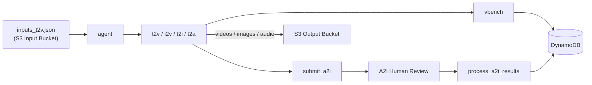
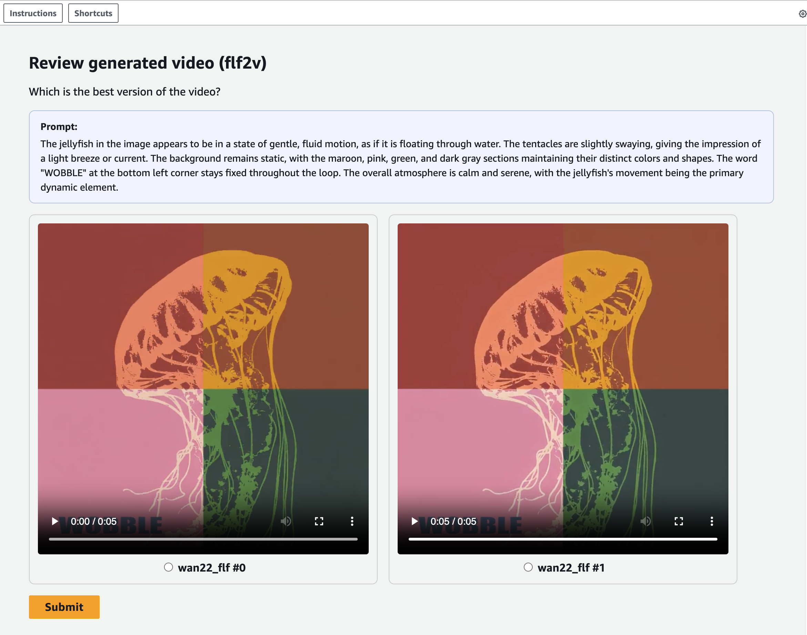

# Operations Guide

This guide covers the full operational lifecycle: verifying container builds, triggering pipelines, monitoring executions, reviewing assets, and tearing down stacks.

> **Navigation:** [← Main README](../README.md) | [Config Guide](CONFIG_GUIDE.md) | [Use Cases](USECASES.md) | [Infrastructure](../infrastructure/README.md)

---

## Table of Contents

- [Post-Deploy: Container Builds](#post-deploy-container-builds)
- [Triggering Pipelines](#triggering-pipelines)
- [Input Data](#input-data)
- [Viewing Results](#viewing-results)
- [Monitoring](#monitoring)
- [A2I Human Review](#a2i-human-review)
- [Destroy](#destroy)
- [V-RAG Pipeline](#v-rag-pipeline)

---

## Post-Deploy: Container Builds

After `cdk deploy` completes, the dedicated container build pipeline (`ContainerPipelineStack`) automatically builds all Docker images for every processing step and container-image Lambda. ECR images must exist before any processing job can run — wait for all builds to finish before proceeding.

### Verify Build Completion

Check the container build pipeline status in the **AWS Console → CodePipeline**, or use the CLI:

```bash
# Check the latest build status for a specific step (replace PREFIX with your full prefix, e.g. devvr)
aws codebuild list-builds-for-project \
  --project-name PREFIX-agent-build \
  --query 'ids[0]' --output text --region REGION \
  | xargs -I{} aws codebuild batch-get-builds \
    --ids {} \
    --query 'builds[0].buildStatus' --output text --region REGION
```

### Check Individual CodeBuild Projects

Each pipeline step has its own CodeBuild project named `PREFIX-{step}-build`. To check all projects for a given prefix:

```bash
aws codebuild list-projects \
  --query "projects[?starts_with(@, 'PREFIX-')]" \
  --output table --region REGION
```

To check the status of a specific project:

```bash
aws codebuild list-builds-for-project \
  --project-name PREFIX-t2v-build \
  --max-items 1 --region REGION \
  --query 'ids[0]' --output text \
  | xargs -I{} aws codebuild batch-get-builds \
    --ids {} \
    --query 'builds[0].{Status:buildStatus,Start:startTime,End:endTime}' \
    --output table --region REGION
```

---

## Triggering Pipelines

After deploy and container builds are complete, use the following steps to run a pipeline. Replace `PREFIX` with your full prefix (e.g. `devvr`, `devi2v`), `ACCOUNT` with your AWS account ID, and `REGION` with your AWS region.

### (a) Download Models (one-time)

Downloads all model weights from HuggingFace/GitHub to the models S3 bucket. Only needs to run once per environment, or when `s3_downloads` in the config changes. Files already present in S3 are skipped automatically.

There is no standalone Lambda for model downloads — the `processing_job/model_download/` container code runs directly inside CodeBuild (not as a SageMaker Processing Job). The container directory exists because the same `main.py` script is reused by both deployment methods below. Model downloads are handled in one of two ways depending on your deployment method:

**CI/CD deployments (recommended):** Model downloads run automatically in the `ModelDownloadAndUpload` CodeBuild stage as part of the CI/CD pipeline — no manual action needed. The CodeBuild stage executes `processing_job/model_download/main.py` directly.

**Manual deployments:** Run `make deploy-manual` which handles model downloads as part of the deploy flow. This is the correct way to trigger model downloads outside of CI/CD:

```bash
make deploy-manual                         # default config (config_vrag.yaml)
make deploy-manual CONFIG=config_t2i.yaml  # specific config
```

### (b) Upload Input Data

Upload `inputs_t2v.json` (or the appropriate input file for your modality) and any reference images to the input S3 bucket:

```bash
aws s3 cp inputs_t2v.json s3://ACCOUNT-REGION-PREFIX-input-bucket/
aws s3 cp MyImage.png s3://ACCOUNT-REGION-PREFIX-input-bucket/
```

See the [Input Data](#input-data) section below for the JSON format and sample files.

### (c) Trigger the SageMaker Pipeline

```bash
aws lambda invoke \
  --function-name PREFIX-pipeline-trigger-Lambda \
  /dev/null --log-type Tail --query 'LogResult' --output text --region REGION | base64 -d
```

The pipeline runs the full DAG defined in the pipeline config's `pipeline_graph`. Monitor progress in the **SageMaker Console → Pipelines**, or see the [Monitoring](#monitoring) section.

### SageMaker Pipeline DAG

The following diagram shows the general processing flow for a pipeline with generation, evaluation, and A2I review steps. The actual steps depend on the pipeline config — see [Use Cases](USECASES.md) for per-config DAGs.



---

## Input Data

Pipeline input is a JSON array uploaded to the S3 input bucket as `inputs_t2v.json` (for visual modalities) or `inputs_audio.json` (for audio). The format depends on the modality.

### Visual Entries (`VisualEntry`)

Used by T2V, I2V, T2I, captioning, and FLF2V pipelines.

| Field | Type | Required | Description |
|---|---|---|---|
| `id` | string | Yes | Unique identifier for this input |
| `prompt` | string | Yes | Text prompt describing the desired output |
| `image` | string | No | Filename of a reference image (uploaded to the same S3 bucket). Used by I2V and FLF2V. |

Example:

```json
[
  {
    "id": "tokyo-rain-alley",
    "prompt": "A slow cinematic tracking shot down a rain-soaked Tokyo alleyway at night..."
  },
  {
    "id": "paraglider-coast",
    "prompt": "Slow cinematic aerial shot of paragliders over a mountainous coastline...",
    "image": "pexels-adempercem-35576326.jpg"
  }
]
```

### Audio Entries (`AudioEntry`)

Used by the T2A pipeline.

| Field | Type | Required | Default | Description |
|---|---|---|---|---|
| `id` | string | Yes | — | Unique identifier |
| `tags` | string | Yes | — | Genre and style description |
| `lyrics` | string | Yes | — | Song lyrics with section markers |
| `bpm` | int | No | `120` | Beats per minute |
| `duration` | int | No | `120` | Duration in seconds |
| `timesignature` | string | No | `"4"` | Time signature |
| `language` | string | No | `"en"` | Language code |
| `keyscale` | string | No | `"C major"` | Musical key and scale |

Example:

```json
[
  {
    "id": "neo-soul-groove",
    "tags": "Neo-Soul: A warm, organic neo-soul track...",
    "lyrics": "[Intro - Guitar Riff & Drums]\nmm…yeah…\n\n[Verse 1]\nLate night glow...",
    "bpm": 190,
    "duration": 120,
    "timesignature": "4",
    "language": "en",
    "keyscale": "E minor"
  }
]
```

### Pydantic Model Definitions

Both `VisualEntry` and `AudioEntry` are defined as Pydantic v2 models with `strict=True` and `extra='forbid'` in [`processing_job/common/models.py`](../processing_job/common/models.py). All entries extend `BaseEntry` which requires an `id` field.

### Sample Input Data

Working examples are provided in the [`sample_input_data/`](../sample_input_data/) directory:

| File | Modality | Description |
|---|---|---|
| `inputs_t2v.json` | Text-to-Video | 5 cinematic video prompts |
| `inputs_i2v.json` | Image-to-Video | 3 prompts with reference images |
| `inputs_audio.json` | Text-to-Audio | 3 music tracks (Neo-Soul, Lo-Fi, Cumbia) |

Reference images for I2V are in `sample_input_data/images/`.

---

## Viewing Results

After a pipeline run completes, browse generated assets using the Streamlit viewer:

```bash
make view
```

This launches a local Streamlit app that reads from S3 output buckets.

### Available Filters

- **Construct ID** — select which pipeline's outputs to browse
- **Step** — select which processing step's output bucket to view
- **Execution ID** — filter assets by SageMaker Pipeline execution
- **Media type** — filter by video, image, audio, or all

### Supported Formats

| Media Type | Formats |
|---|---|
| Video | `.mp4`, `.webm`, `.mkv` |
| Image | `.png`, `.jpg`, `.jpeg`, `.gif`, `.webp`, `.bmp` |
| Audio | `.mp3`, `.wav`, `.ogg`, `.flac`, `.aac` |

For more details, see [`view_assets/README.md`](../view_assets/README.md).

---

## Monitoring

### Pipeline Execution Status

Check the latest pipeline execution via the **SageMaker Console → Pipelines**, or:

```bash
aws sagemaker list-pipeline-executions \
  --pipeline-name PREFIX-pipeline \
  --sort-by CreationTime --sort-order Descending --max-results 1 \
  --query 'PipelineExecutionSummaries[0].{Status:PipelineExecutionStatus,Arn:PipelineExecutionArn}' \
  --output table --region REGION
```

### Processing Job Status

Check individual processing job status:

```bash
aws sagemaker list-processing-jobs \
  --name-contains PREFIX \
  --sort-by CreationTime --sort-order Descending --max-results 5 \
  --query 'ProcessingJobSummaries[*].{Name:ProcessingJobName,Status:ProcessingJobStatus}' \
  --output table --region REGION
```

---

## A2I Human Review

Pipelines with A2I enabled submit generated assets to Amazon Augmented AI for human quality review. Lambda steps (e.g. `submit_a2i_t2v`, `submit_a2i_t2i`) run after their respective generation steps, creating one human loop per generated asset.

### Accessing the Workforce Portal

1. Find your portal URL:

   ```bash
   aws sagemaker describe-workteam \
     --workteam-name PREFIX-video-review-team \
     --query 'Workteam.SubDomain' --output text --region REGION
   ```

   The portal URL is: `https://<SUBDOMAIN>.labeling.<REGION>.sagemaker.aws`

2. Log in with a Cognito user from the configured user pool that belongs to the `PREFIX-video-review-reviewers` group.

3. Pending human loops appear as tasks — review each asset and mark Yes/No for quality.

### Adding Reviewers via Cognito

You can add reviewers using the AWS CLI or the SageMaker console. For console-based management, see [Add or Remove Workers](https://docs.aws.amazon.com/sagemaker/latest/dg/sms-workforce-management-private-console.html#add-remove-workers-sm) in the SageMaker documentation.

Via CLI:

```bash
# Create a new user
aws cognito-idp admin-create-user \
  --user-pool-id USER_POOL_ID \
  --username reviewer@example.com \
  --region REGION

# Add to the reviewers group
aws cognito-idp admin-add-user-to-group \
  --user-pool-id USER_POOL_ID \
  --username reviewer@example.com \
  --group-name PREFIX-video-review-reviewers \
  --region REGION
```

### Review Results Flow

Once a reviewer completes a task:

1. A2I writes the review result to the A2I output S3 bucket
2. EventBridge triggers the `process_a2i_results` Lambda via SNS
3. The Lambda parses the review result and writes it to the DynamoDB results table
4. Selected assets are marked with a `selected_flag` for downstream querying



---

## Destroy

### Full Teardown

Destroy all stacks across all pipeline configs:

```bash
make destroy
```

### Per-Config Teardown

Destroy stacks for a specific pipeline config:

```bash
cdk destroy PREFIX-PipelineStack PREFIX-A2IStack PREFIX-DataStack \
  --force -c config_file=CONFIG_FILENAME
```

For example, to destroy the I2V pipeline:

```bash
cdk destroy devi2v-PipelineStack devi2v-A2IStack devi2v-DataStack \
  --force -c config_file=config_i2v.yaml
```

> **Note:** Shared stacks (`dev-SecurityStack`, `dev-CodeBuildStack`, `dev-CiCdPipelineStack`, `dev-ContainerPipelineStack`) are shared across all pipeline configs. Only destroy them when tearing down the entire environment.

See the [Makefile Commands](../README.md#makefile-commands) table for a quick reference of all available commands.

---

## V-RAG Pipeline

The V-RAG (Video Retrieval-Augmented Generation) pipeline uses real images to generate cinematic video prompts and feed them into the I2V generation step. This section covers the end-to-end operational workflow. See [`config_vrag.yaml`](../config/pipeline/config_vrag.yaml) for the pipeline configuration.

### Architecture

```
┌─────────────────────────────────────────────────────────────────────┐
│  Setup Processing Job (standalone, triggered via Lambda)            │
│                                                                     │
│  1. Download dataset images (source depends on dataset_script)     │
│  2. Resize images (max 1664px) and upload to S3 retrieval bucket   │
│  3. Generate video prompts via parallel Strands Agents              │
│  4. Write inputs_i2v.json to DataStack input bucket                │
│  5. Verify AOSS document count                                     │
└──────────────┬──────────────────────────────────┬───────────────────┘
               │                                  │
               ▼                                  ▼
┌──────────────────────────┐    ┌─────────────────────────────────────┐
│  Retrieval Ingestion     │    │  SageMaker Pipeline                 │
│                          │    │                                     │
│  S3 (images/) trigger    │    │  vrag_llm → retrieval → i2v        │
│  → SQS queue             │    │                          ↓          │
│  → Ingest Lambda (x40)  │    │              vbench_i2v / submit_a2i │
│  → Bedrock embed         │    │                                     │
│  → AOSS vector index     │    │  LLM refines prompts, retrieval     │
│                          │    │  finds matching images from AOSS,   │
│                          │    │  i2v generates videos               │
└──────────────────────────┘    └─────────────────────────────────────┘
```

### Dataset Sources

The setup job supports two image dataset sources. The active dataset is controlled by the `dataset_script` and `dataset_url` fields in the pipeline config's `setup.dataset_ingest` section.

| Dataset | Script | URL | Description |
|---|---|---|---|
| **Unsplash Lite** (default) | `unsplash.py` | `1aurent/unsplash-lite` (HuggingFace) | ~25k curated photos from the Unsplash Research Lite dataset. Downloads from HuggingFace, resizes to max 1664px, and uploads to S3. |
| **Open Images V7** | `open_images_v7.py` | `https://storage.googleapis.com/openimages/2018_04/image_ids_and_rotation.csv` (Google Storage) | Large-scale dataset from Google's Open Images V7. Downloads image metadata CSV from Google Storage, filters by resolution, and uploads qualifying images to S3. |

To switch between datasets, edit `config/pipeline/config_vrag.yaml` under `setup.dataset_ingest`:

```yaml
# Option A: Unsplash Lite (default — smaller, curated)
dataset_script: "unsplash.py"
dataset_url: "1aurent/unsplash-lite"

# Option B: Open Images V7 (larger, diverse)
dataset_script: "open_images_v7.py"
dataset_url: "https://storage.googleapis.com/openimages/2018_04/image_ids_and_rotation.csv"
```

Both scripts expose the same interface (`load_and_upload(s3_client, bucket, limit) -> list[dict]`), so switching is seamless — just update the two fields and redeploy.

### Prerequisites

- All stacks deployed (SecurityStack, DataStack, CodeBuildStack, PipelineStack)
- All CodeBuild image builds completed (see [Post-Deploy: Container Builds](#post-deploy-container-builds))
- Model weights downloaded (see [Download Models](#a-download-models-one-time))

### Step 1: Trigger the Dataset Ingest Setup Job

The setup job downloads images from the configured dataset source (see [Dataset Sources](#dataset-sources)), uploads them to S3 (triggering AOSS ingestion), and generates video prompts via parallel Strands Agents.

```bash
aws lambda invoke \
  --function-name PREFIX-dataset_ingest-trigger-Lambda \
  --region REGION \
  /tmp/setup-response.json

cat /tmp/setup-response.json
```

The response contains the `ProcessingJobArn`. Extract the job name to monitor:

```bash
aws sagemaker describe-processing-job \
  --processing-job-name JOB_NAME \
  --region REGION \
  --query 'ProcessingJobStatus' \
  --output text
```

**Expected duration**: ~30 minutes (16 min image upload + ~10 min parallel prompt generation + 5 min AOSS verification)

**Expected output**:
- ~5k images in `s3://ACCOUNT-REGION-PREFIX-retrieval-images-bucket/images/`
- ~5k documents in AOSS `image-vectors` index
- `inputs_i2v.json` (1000 VisualEntry objects) in `s3://ACCOUNT-REGION-PREFIX-input-bucket/`

### Step 2: Verify AOSS Ingestion

The ingestion pipeline (S3 → SQS → Lambda → Bedrock → AOSS) runs asynchronously. After the setup job completes, give it a few minutes to finish processing, then check:

```bash
aws lambda invoke \
  --function-name PREFIX-retrieval-load-test-Lambda \
  --region REGION \
  --cli-binary-format raw-in-base64-out \
  --payload '{"num_images": 1, "timeout": 5, "poll_interval": 5, "cleanup": true}' \
  /tmp/aoss-check.json

cat /tmp/aoss-check.json | python3 -m json.tool | grep document_count_final
```

### Step 3: Trigger the SageMaker Pipeline

Once the setup job is complete and `inputs_i2v.json` is in the input bucket:

```bash
aws lambda invoke \
  --function-name PREFIX-pipeline-trigger-Lambda \
  --region REGION \
  /dev/null --log-type Tail --query 'LogResult' --output text | base64 -d
```

The pipeline reads `inputs_i2v.json`, runs the I2V step to generate videos, then evaluates with VBench.

### Step 4: Monitor

Check pipeline execution in the **SageMaker Console → Pipelines**, or:

```bash
aws sagemaker list-pipeline-executions \
  --pipeline-name PREFIX-pipeline \
  --sort-by CreationTime --sort-order Descending --max-results 1 \
  --region REGION \
  --query 'PipelineExecutionSummaries[0].{Status:PipelineExecutionStatus,Arn:PipelineExecutionArn}' \
  --output table
```

### Configuration

All setup job settings are in `config/pipeline/config_vrag.yaml` under the `setup` key:

```yaml
setup:
  dataset_ingest:
    InstanceType: ml.m5.4xlarge
    VolumeSizeInGB: 125
    ContainerEntrypoint: ["python3", "main.py"]
    ContainerArguments: ["--run"]
    models_prefix: []
    dataset_url: "1aurent/unsplash-lite"
    dataset_script: "unsplash.py"
    num_prompts: 1000          # Number of video prompts to generate
    test_image_count: 25000    # Max images to process (set lower for testing)
```

To use Open Images V7 instead, change `dataset_script` and `dataset_url` — see [Dataset Sources](#dataset-sources) for the values.

For quick testing, set `test_image_count: 500` and `num_prompts: 100` (~10 min run).

### Cleanup

To clear all data and start fresh:

```bash
# 1. Purge AOSS index
aws lambda invoke \
  --function-name PREFIX-retrieval-load-test-Lambda \
  --region REGION \
  --cli-binary-format raw-in-base64-out \
  --payload '{"action": "purge"}' \
  /tmp/purge.json

# 2. Purge SQS queues (if messages are stuck)
aws sqs purge-queue \
  --queue-url https://sqs.REGION.amazonaws.com/ACCOUNT/PREFIX-retrieval-ingest-queue \
  --region REGION

aws sqs purge-queue \
  --queue-url https://sqs.REGION.amazonaws.com/ACCOUNT/PREFIX-retrieval-ingest-queue-dlq \
  --region REGION
```

Or re-run the setup job — it's idempotent (overwrites existing S3 keys, upserts AOSS documents).

### V-RAG Troubleshooting

**Images not appearing in AOSS**: Check the ingest Lambda logs for errors. Common issue: images too large for Bedrock embedding (max ~4.2M pixels). The setup container resizes to 1664px max, but if you bypass it, large images will fail.

```bash
aws logs filter-log-events \
  --log-group-name "/aws/lambda/PREFIX-retrieval-ingest-Lambda" \
  --region REGION \
  --filter-pattern "ERROR" \
  --start-time $(python3 -c "import time; print(int((time.time() - 3600) * 1000))") \
  --limit 5
```

**SQS messages stuck in-flight**: Messages that fail repeatedly stay invisible until the visibility timeout (960s) expires. Purge the queue to clear them immediately (see [Cleanup](#cleanup)).

**Setup job failures**: Check CloudWatch logs at `/aws/sagemaker/ProcessingJobs/{job-name}/algo-1-*`. Common issues: missing env vars, HuggingFace download timeout, Bedrock throttling.

---

## Navigation

- [← Main README](../README.md)
- [Config Authoring Guide](CONFIG_GUIDE.md)
- [Pipeline Use Cases](USECASES.md)
- [Infrastructure](../infrastructure/README.md)
