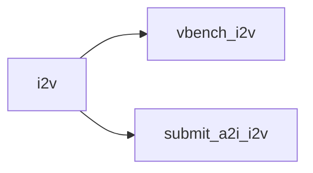
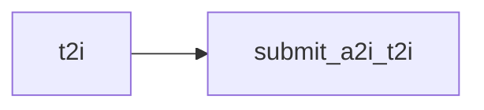
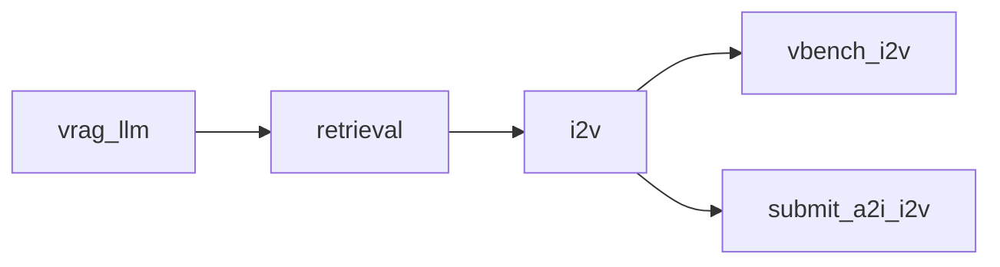
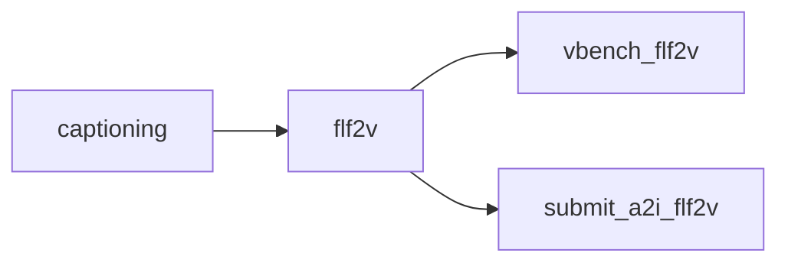

# Pipeline Use Cases Guide

> **Navigation:** [← Main README](../README.md) | [Config Authoring Guide](CONFIG_GUIDE.md) | [Operations Guide](OPERATIONS.md) | [config/README.md](../config/README.md)

## Overview

Each YAML file in `config/pipeline/` defines a self-contained SageMaker Pipeline use case. The framework reads the config at CDK synth time and creates all required infrastructure — ECR repos, CodeBuild projects, processing steps, Lambda functions, A2I flows — automatically.

Pipeline configs are organized into two categories:

- **Base Configs** — Core single-modality pipelines. Each targets one generation modality (image, video, or audio) with optional evaluation and A2I human review. Use these as starting points or production workhorses. Base configs are also the building blocks for composing more complex pipelines — the Example Use Cases below combine and extend these foundational configs to create multi-step workflows.
- **Example Use Cases** — Advanced multi-step compositions that combine multiple modalities, retrieval augmentation, or chained processing steps. These demonstrate the framework's flexibility for complex workflows.

| Config File | Category | Modality | Description |
|---|---|---|---|
| [`config_i2v.yaml`](#image-to-video-config_i2vyaml) | Base | Video (I2V) | Image-to-video generation with VBench evaluation and A2I review |
| [`config_t2v.yaml`](#text-to-video-config_t2vyaml) | Base | Video (T2V) | Text-to-video generation with VBench evaluation and A2I review |
| [`config_t2i.yaml`](#text-to-image-config_t2iyaml) | Base | Image | Text-to-image generation with A2I review |
| [`config_t2a.yaml`](#text-to-audio-config_t2ayaml) | Base | Audio | Text-to-audio generation with A2I review |
| [`config_vrag.yaml`](#v-rag-pipeline-config_vragyaml) | Example | Video (I2V) | Retrieval-augmented video generation with LLM prompt refinement, VBench evaluation, and A2I review |
| [`config_motionart.yaml`](#motionart-transitions-config_motionartyaml) | Example | Video (FLF2V) | Image captioning + first-last-frame-to-video transitions with VBench and A2I review |

---

## Base Configs

### Image-to-Video (`config_i2v.yaml`)

**Use case:** Generate videos from reference images using Wan 2.2 I2V, evaluate quality with VBench, and collect human feedback via A2I review.

**When to use:** You have a set of reference images and want to generate corresponding videos. Ideal for batch I2V generation with automated quality scoring and human review.

#### DAG

Two parallel branches from the I2V generation step: VBench evaluates video quality, and A2I submits videos for human review.

#### Steps

| Step | Type | Instance Type | Count | Purpose |
|---|---|---|---|---|
| `i2v` | Processing | ml.g5.xlarge | 2 | Image-to-video generation (Wan 2.2 I2V). `num_assets_per_prompt: 2` |
| `vbench_i2v` | Processing | ml.g5.xlarge | 1 | VBench evaluation of I2V outputs |
| `submit_a2i_i2v` | Lambda | — | — | Submits generated videos for A2I human review |

#### Models

- **Wan 2.2 I2V** — diffusion models (high/low noise 14B fp8), LoRAs (LightX2V 4-step), text encoder (UMT5-XXL fp8), VAE
- **VBench** — aesthetic predictor, AMT, caption model (Tag2Text), CLIP (ViT-B-32, ViT-L-14), GRIT, MUSIQ, RAFT, UMT, ViCLIP, DINO

#### A2I

| Flow | Media Type | Task Title |
|---|---|---|
| `i2v` | video | "Review generated video (i2v)" |

---

### Text-to-Video (`config_t2v.yaml`)

**Use case:** Generate videos from text prompts using Wan 2.2 T2V, evaluate quality with VBench, and collect human feedback via A2I review.

**When to use:** You have text prompts and want to generate videos. Ideal for batch T2V generation with automated quality scoring and human review.

#### DAG

Two parallel branches from the T2V generation step: VBench evaluates video quality, and A2I submits videos for human review.

#### Steps

| Step | Type | Instance Type | Count | Purpose |
|---|---|---|---|---|
| `t2v` | Processing | ml.g5.xlarge | 2 | Text-to-video generation (Wan 2.2). `num_assets_per_prompt: 3` |
| `vbench_t2v` | Processing | ml.g5.xlarge | 1 | VBench evaluation of T2V outputs |
| `submit_a2i_t2v` | Lambda | — | — | Submits generated videos for A2I human review |

#### Models

- **Wan 2.2 T2V** — diffusion models (high/low noise 14B fp8), LoRAs (LightX2V 4-step v1.1), text encoder (UMT5-XXL fp8), VAE
- **VBench** — aesthetic predictor, AMT, caption model (Tag2Text), CLIP (ViT-B-32, ViT-L-14), GRIT, MUSIQ, RAFT, UMT, ViCLIP, DINO

#### A2I

| Flow | Media Type | Task Title |
|---|---|---|
| `t2v` | video | "Review generated video (t2v)" |

---

### Text-to-Image (`config_t2i.yaml`)

**Use case:** Generate images from text prompts using Z-Image-Turbo and collect human feedback via A2I review.

**When to use:** You have text prompts and want to generate images. A lightweight pipeline with fast turbo-mode inference and human review — no VBench evaluation step.

#### DAG

Linear pipeline: generate images, then submit for human review.

#### Steps

| Step | Type | Instance Type | Count | Purpose |
|---|---|---|---|---|
| `t2i` | Processing | ml.g5.xlarge | 2 | Text-to-image generation (Z-Image-Turbo). `num_assets_per_prompt: 3` |
| `submit_a2i_t2i` | Lambda | — | — | Submits generated images for A2I human review |

#### Models

- **Z-Image-Turbo** — text encoder (Qwen 3 4B), VAE, diffusion model (bf16)

#### A2I

| Flow | Media Type | Task Title |
|---|---|---|
| `t2i` | image | "Review generated image" |

---

### Text-to-Audio (`config_t2a.yaml`)

**Use case:** Generate audio from text prompts using ACE Step 1.5 Turbo AIO and collect human feedback via A2I review.

**When to use:** You have text prompts describing music (tags, lyrics, BPM, duration) and want to generate audio tracks. A lightweight pipeline with a single generation step and human review.

#### DAG

Linear pipeline: generate audio, then submit for human review.

#### Steps

| Step | Type | Instance Type | Count | Purpose |
|---|---|---|---|---|
| `t2a` | Processing | ml.g5.xlarge | 2 | Text-to-audio generation (ACE Step 1.5 Turbo AIO). `num_assets_per_prompt: 3` |
| `submit_a2i_t2a` | Lambda | — | — | Submits generated audio for A2I human review |

#### Models

- **ACE Step 1.5 Turbo AIO** — single checkpoint (`ace_step_1.5_turbo_aio.safetensors`)

#### A2I

| Flow | Media Type | Task Title |
|---|---|---|
| `t2a` | audio | "Review generated audio" |

---

## Example Use Cases

### V-RAG Pipeline (`config_vrag.yaml`)

**Use case:** Retrieval-augmented video generation that produces videos visually matching an existing image library. Combines LLM prompt refinement, image retrieval from OpenSearch Serverless, I2V generation, VBench evaluation, and A2I human review. Ideal for brand-consistent video generation and stock footage augmentation — the retrieval step ensures generated videos align with the visual style and content of your curated image dataset.

**When to use:** Large-scale video generation where you want to augment text prompts with retrieved reference images. The LLM refines prompts, the retrieval step finds similar images from an ingested dataset, and the I2V branch generates videos at high instance counts.

#### DAG

- **Retrieval-augmented I2V branch:** `vrag_llm` → `retrieval` → `i2v` → `vbench_i2v` / `submit_a2i_i2v`

#### Steps

| Step | Type | Instance Type | Count | Purpose |
|---|---|---|---|---|
| `vrag_llm` | Processing | ml.m5.xlarge | 1 | V-RAG prompt refinement via LLM (`VRAG_LLM_WORKERS: 10`, model: `qwen.qwen3-32b-v1:0`) |
| `retrieval` | Processing | ml.c5.xlarge | 1 | Query AOSS for similar images |
| `i2v` | Processing | ml.g5.xlarge | 40 | Image-to-video generation (Wan 2.2). `num_assets_per_prompt: 1` |
| `vbench_i2v` | Processing | ml.g5.xlarge | 20 | VBench evaluation of I2V outputs |
| `submit_a2i_i2v` | Lambda | — | — | Submits generated videos for A2I human review |

#### Models

- **Wan 2.2 I2V** — diffusion models (high/low noise 14B fp8), LoRAs (LightX2V 4-step), text encoder (UMT5-XXL fp8), VAE
- **VBench** — aesthetic predictor, AMT, caption model (Tag2Text), CLIP (ViT-B-32, ViT-L-14), GRIT, MUSIQ, RAFT, UMT, ViCLIP, DINO

#### Retrieval Integration

This pipeline references `retrieval: "retrieval.yaml"`, which activates the RetrievalStack with OpenSearch Serverless, SQS ingestion, and Bedrock embedding (Nova multimodal). The `retrieval` step queries AOSS for nearest-neighbor images to augment the I2V branch.

#### Setup Jobs

| Setup Job | Instance Type | Count | Purpose |
|---|---|---|---|
| `dataset_ingest` | ml.m5.4xlarge | 1 | Downloads dataset images (Unsplash Lite), uploads to S3, generates video prompts. Config: `num_prompts: 1000`, `test_image_count: 25000` |

#### A2I

| Flow | Media Type | Task Title |
|---|---|---|
| `vid_i2v` | video | "Review generated video (i2v)" |

---

### MotionArt (`config_motionart.yaml`)

**Use case:** Create looping transition animations between image pairs. Captions image pairs using a vision-language model, then generates smooth transition videos using first-last-frame-to-video (FLF2V) generation, with VBench evaluation and A2I human review. Well-suited for product showcases, art installations, and social media content where seamless looping visuals create an engaging viewing experience.

**When to use:** You have pairs of images and want to create smooth looping transition animations between them. The captioning step generates descriptions of each image, and the FLF2V step uses those captions plus the images to generate transition videos.

#### DAG

Linear pipeline with a fork: caption image pairs, generate transition videos, then evaluate with VBench and submit for human review in parallel.

#### Steps

| Step | Type | Instance Type | Count | Purpose |
|---|---|---|---|---|
| `captioning` | Processing | ml.g5.xlarge | 1 | Image captioning via Qwen2.5-VL-7B-Instruct (`CAPTION_MODEL_NAME: qwen2_5_vl_7b`) |
| `flf2v` | Processing | ml.g5.8xlarge | 1 | First-last-frame-to-video generation (Wan 2.2 I2V). `num_assets_per_prompt: 2` |
| `vbench_flf2v` | Processing | ml.g5.xlarge | 1 | VBench evaluation of FLF2V outputs |
| `submit_a2i_flf2v` | Lambda | — | — | Submits generated videos for A2I human review |

#### Models

- **Qwen2.5-VL-7B-Instruct** — vision-language model (5 shards), tokenizer, config, preprocessor
- **Wan 2.2 I2V** — diffusion models (high/low noise 14B fp8), LoRAs (LightX2V 4-step), text encoder (UMT5-XXL fp8), VAE
- **VBench** — aesthetic predictor, AMT, caption model (Tag2Text), CLIP (ViT-B-32, ViT-L-14), GRIT, MUSIQ, RAFT, UMT, ViCLIP, DINO

#### A2I

| Flow | Media Type | Task Title |
|---|---|---|
| `motion_art` | video | "Review generated video (flf2v)" |

---

## Navigation

- [← Main README](../README.md) — Project overview and getting started
- [Config Authoring Guide](CONFIG_GUIDE.md) — How to create and customize pipeline config YAMLs
- [Operations Guide](OPERATIONS.md) — Deploy, trigger, monitor, and troubleshoot pipelines
- [config/README.md](../config/README.md) — Pydantic models, directory layout, retrieval and CI/CD config
