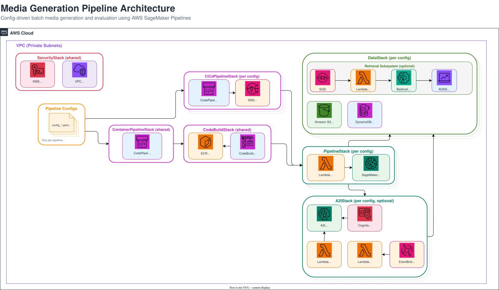

> **Navigation:** [← Main README](../README.md) | [Operations Guide](../docs/OPERATIONS.md)

## Table of Contents

- [Stack Dependency Graph](#stack-dependency-graph)
- [security.py — SecurityStack](#securitypy--securitystack)
- [data.py — DataStack](#datapy--datastack)
- [codebuild_stack.py — CodeBuildStack](#codebuild_stackpy--codebuildstack)
- [pipeline.py — PipelineStack](#pipelinepy--pipelinestack)
- [a2i_stack.py — A2IStack](#a2i_stackpy--a2istack)
- [cicd_pipeline/ — CiCdPipelineStack & ContainerPipelineStack](#cicd_pipeline--cicdpipelinestack--containerpipelinestack)
- [Deploying](#deploying)
- [Full Architecture Diagram](#full-architecture-diagram)

# infrastructure/

CDK stacks that compose the project's AWS resources. Each stack is instantiated in `app.py` with explicit inter-stack dependencies so CloudFormation deploys them in the correct order.

## Stack Dependency Graph

```
SecurityStack
  ├── CodeBuildStack
  ├── DataStack
  │     └── A2IStack (optional, when a2i: config + matching lambda_steps: exist)
  ├── PipelineStack (depends on SecurityStack, DataStack, and optionally A2IStack)
  ├── CiCdPipelineStack (optional, when cicd.enabled=true)
  └── ContainerPipelineStack (optional, depends on SecurityStack + CiCdPipelineStack)
```

## security.py — `SecurityStack`

Foundational networking and encryption layer that every other stack depends on.

Creates:
- VPC with 2 AZs, 1 NAT gateway, public + private subnets
- Customer-managed KMS key (alias `/{prefix}-comfyui`) with automatic rotation, shared by all encrypted resources (S3, DynamoDB, CloudWatch, SQS)
- KMS resource policy granting S3 and SQS service access
- VPC Flow Logs to a KMS-encrypted CloudWatch log group (1-month retention)
- Security group with full egress and self-referencing ingress (required for multi-instance SageMaker Processing Jobs where worker nodes communicate with the leader)
- S3 Gateway VPC Endpoint — routes S3 traffic over the AWS backbone instead of through the NAT, improving throughput and reducing cost
- `kms_key_policy` managed policy (Decrypt, DescribeKey, GenerateDataKey) attached by downstream stacks

Exports: `vpc`, `kms_key`, `kms_key_policy`, `security_group`, `subnet_ids`

## data.py — `DataStack`

Persistent storage layer for pipeline inputs, outputs, models, and results.

Creates:
- Logging bucket (S3-managed encryption) for access logs from all other buckets
- Input bucket (`BucketTemplate`) — holds input JSON files (e.g. `inputs_t2v.json`) and source images uploaded before a pipeline run
- Output bucket (`BucketTemplate`) — receives per-step output; each pipeline execution writes under its own execution-ID prefix
- Models bucket (`BucketTemplate`) — stores downloaded model weights (populated by the model-download processing job)
- DynamoDB results table (`DynamoDbTemplate`) — partition key `id`, sort key `step`, with GSIs on `step`, `review_loop_name` (for A2I review lookup), and `selected_flag` (partition key: `selected_flag`, sort key: `step`) for efficient lookup of selected assets. Stores per-input per-step results written by processing containers
- A2I output buckets — one `BucketTemplate` per active A2I config entry (i.e. entries in `a2i:` that are referenced by a `lambda_steps:` entry). These live in DataStack so they survive A2IStack delete/recreate cycles
- Optional `RetrievalConstruct` — created when `retrieval_config` is provided. Provisions OpenSearch Serverless, SQS ingestion queue, and ingestion Lambda inside DataStack

All buckets use KMS encryption, SSL enforcement, block public access, versioning, 90-day object expiry, and 7-day non-current version cleanup. `RemovalPolicy.DESTROY` with auto-delete for dev environments.

Exports: `logs_bucket`, `input_bucket`, `output_bucket`, `models_bucket`, `dynamodb_table`, `a2i_output_buckets`, `retrieval`

## codebuild_stack.py — `CodeBuildStack`

Builds Docker images for every processing step and Lambda function, then pushes them to per-step ECR repositories. A single shared instance is created with `prefix=shared_prefix` (e.g. `dev-CodeBuildStack`), covering all pipeline configs.

Creates per step/Lambda:
- ECR repository (image scanning, 10-image lifecycle, KMS encryption)
- S3 asset from the source directory (`processing_job/{step}` or `lambdas/{lambda}`)
- CodeBuild project (privileged mode for `docker build`, VPC-integrated, KMS-encrypted logs)
  - Processing steps use `LARGE` compute; Lambdas use `SMALL`
  - Env vars: `ECR_REPO_URI`, `AWS_DEFAULT_REGION`, `STEP_NAME`

Additional resources:
- Cross-account ECR pull policy for SageMaker DLC base images (account `763104351884`) — attached to all processing CodeBuild roles

Exports: `ecr_repositories`, `codebuild_projects`, `lambda_ecr_repositories`, `lambda_codebuild_projects`

## pipeline.py — `PipelineStack`

The main orchestration stack. Composes a SageMaker Pipeline from config-driven processing steps, plus a standalone model-download job.

### Model Download Job

Downloads model weights from HuggingFace/GitHub URLs to the models S3 bucket. Model downloads run exclusively as a CI/CD CodeBuild stage — the `ModelDownloadAndUpload` pipeline stage executes `buildspecs.model_download()`, which runs `processing_job/model_download/main.py` directly inside a CodeBuild project on `X2_LARGE` compute. No SageMaker Processing Job or standalone trigger Lambda is involved.

The download manifest (`s3_downloads` in the pipeline config) is written by `app.py` as a per-config file (`{construct_id}_downloads.json`, e.g. `vr_downloads.json`) in the `model_download/` directory at synth time. This avoids clobbering when the CI/CD stack synths multiple configs. The `main.py` resolves the correct manifest at runtime by stripping the `SHARED_PREFIX` env var from `CONFIG_PREFIX` to derive the `construct_id` (e.g. `CONFIG_PREFIX=devvr` minus `SHARED_PREFIX=dev` → `construct_id=vr`). Files already present in S3 are skipped automatically.

### Pipeline Steps

For each step defined in the pipeline config's `steps`:

1. Creates a per-step output bucket
2. Wires input buckets based on the DAG (`pipeline_graph`):
   - Root steps (no deps) read from DataStack's input bucket
   - Multi-instance steps with `include_data_input` get sharded input from parent on a `shards` channel + FullyReplicated data from DataStack on the step's input channel
   - Multi-instance steps without `include_data_input` shard parent output directly on the step's input channel (no DataStack mount)
   - Single-dep steps read from parent's output bucket
3. Adds models bucket channels based on `models_prefix` config
4. Creates a `ReusableProcessingJob` with the step's ECR image, instance config, and environment variables (`DYNAMODB_TABLE_NAME`, `STEP_NAME`, `LOCAL_OUTPUT_DIR`, `UPSTREAM_STEP`)
5. Attaches DynamoDB read/write policy to each job role

The steps are assembled into a `PipelineConstruct` which:
- Converts job definitions to pipeline step JSON
- Resolves step dependencies from the DAG
- Injects `EXECUTION_ID` into every step
- Rewrites S3 output URIs to include the execution ID as a path prefix

### Pipeline Trigger Lambda

A `LambdaTemplate` (`trigger_pipeline`) that calls `StartPipelineExecution` on the SageMaker Pipeline. Deployed as a container image from CodeBuild. Invoked manually or by external automation to kick off a new pipeline run.

### IAM

- Bedrock step policies: any processing step that requires Bedrock access gets a dynamically-scoped IAM managed policy derived from its model ID environment variable. The model ID is parsed to extract a `foundation_model` prefix (stripping region prefixes like `us.` for `foundation-model` ARNs) and a `base_model` prefix (stripping version suffixes like `:0` for `inference-profile` ARNs). Both ARN types are included with wildcards so switching Bedrock models requires only a config change — no CDK code updates. The same pattern is used by the retrieval setup job's Bedrock policy.
- Pipeline execution role: assumed by `sagemaker.amazonaws.com`, has `CreateProcessingJob`/`DescribeProcessingJob` and `PassRole` for every processing job role
- Pipeline execution policy: `StartPipelineExecution` scoped to the pipeline ARN, attached to the trigger Lambda

#### Config-Specific Notes

- `vrag_llm` step: reads its model ID from the `VRAG_LLM_MODEL_ID` environment variable (defaults to `qwen.qwen3-32b-v1:0`). Grants `bedrock:InvokeModel` and `bedrock:InvokeModelWithResponseStream`.
- Retrieval setup job: uses a fixed model (`us.amazon.nova-2-lite-v1:0`) for the Strands Agent. Region-prefixed IDs (e.g. `us.amazon.nova-*`) resolve to `inference-profile` ARNs; others resolve to `foundation-model` ARNs.

### CfnOutputs

- `{prefix}-PipelineArn` — SageMaker Pipeline ARN
- `{prefix}-TriggerLambdaName` — pipeline trigger Lambda function name

## a2i_stack.py — `A2IStack`

Human-in-the-loop review infrastructure using Amazon Augmented AI (A2I). Only created when both an `a2i:` configuration block and matching `lambda_steps:` entries exist in the pipeline config.

Creates:
- A2I flow definitions (via `AwsCustomResource`, since CDK has no L2 construct for A2I) — one per review type defined in the `a2i:` config
- Liquid HTML task UI templates for video, image, and audio review — dynamically generated based on `media_type`
- Cognito-backed private workteam (`WorkteamConstruct`) for reviewer authentication
- Submit Lambda (`submit_a2i_review`) — invoked as a SageMaker Pipeline Lambda step after generation; lists generated assets from the output bucket, fetches the display prompt from DynamoDB with a fallback chain (`prompt` → `tags` → `lyrics`) to support different modalities, and starts one A2I human loop per asset. Receives `TASK_TITLE` and `TASK_DESCRIPTION` from the A2I config as environment variables for customizing the review UI per flow
- Process Lambda (`process_a2i_results`) — triggered via SNS when a human loop completes; parses review decisions and writes results to DynamoDB
- SNS notification topic per flow — receives A2I human loop completion events and fans out to the process Lambda

Note: A2I output S3 buckets live in DataStack (not A2IStack) so they survive A2IStack delete/recreate cycles.

Depends on: `SecurityStack` (VPC, KMS key, security group), `DataStack` (DynamoDB table, output bucket), `CodeBuildStack` (ECR images for submit/process Lambdas)

Exports: `flow_definitions`, `submit_lambdas`, `workteam`

## cicd_pipeline/ — `CiCdPipelineStack` & `ContainerPipelineStack`

Directory containing the CI/CD pipeline infrastructure, split across multiple modules:

| Module | Purpose |
|---|---|
| `stack.py` | `CiCdPipelineStack` — per-config CodePipeline orchestration |
| `helpers.py` | Shared helper functions for pipeline construction |
| `buildspecs.py` | CodeBuild buildspec generators (lint, test, deploy, model download, container step build) |
| `container_stack.py` | `ContainerPipelineStack` — dedicated container build pipeline stack |
| `container_pipeline.py` | `create_container_pipeline()` factory for the container build pipeline |
| `deploy_script.py` | Adaptive CDK deployment strategy (first-time, fallback, two-phase update) |
| `resolve_stacks.py` | Stack name resolution for deploy targets |
| `codebuild_stack.py` | CodeBuild project creation helpers for pipeline stages |
| `policies.py` | IAM policy builders for pipeline roles |

Optional self-mutating CodePipeline for automated build, test, and deploy. Only created when `cicd.yaml` has `enabled: true`. Creates one independent CodePipeline per config file listed in `cicd.yaml` `pipeline_configs`. The QualityGate stage runs two parallel CodeBuild actions: LintAndSynth (`lint_and_synth()` buildspec — pre-commit hooks + CDK synthesis) and Test (`unit_test()` buildspec — pytest with per-config markers).

Creates:
- Artifact S3 bucket (KMS-encrypted, SSL-enforced) with a logging bucket
- SNS topic for failure notifications (optional email subscription via `notification_email`)
- Per-config S3 source assets — each pipeline gets its own source asset whose content hash covers shared directories (`infrastructure/`, `project_constructs/`, `app.py`, `lambdas/`, `tests/`, `schema/`, `config/config.py`, `config/cicd/`, `config/retrieval/`, `.pre-commit-config.yaml`, `pyproject.toml`, `Makefile`) plus that pipeline's own config file (`config/pipeline/{cfg_file}`), so changing one config only triggers that pipeline. Automatic S3 triggers start pipelines when their source asset is updated
- CodeBuild projects for each pipeline stage (QualityGate with LintAndSynth/Test actions, Deploy, ModelDownload, and optionally PipelineTrigger and A2ISmokeTest) — all VPC-deployed with KMS-encrypted logs
- CodePipeline assembling Source → QualityGate → Deploy → ModelDownload (+ optional stages)
- CloudWatch Events rule targeting SNS on pipeline failure

The Deploy stage contains a single Deploy action that runs the adaptive CDK deployment strategy (first-time deploy, new-stack fallback, or two-phase update). Container builds are handled separately by the dedicated container build pipeline (`container_pipeline.py`).

All CodeBuild projects receive `AWS_ACCOUNT_ID` and `REGION` as plaintext environment variables. The Deploy stage gets `AdministratorAccess` for CDK deploy operations. The ModelDownload stage uses a config hash to conditionally skip downloads when nothing changed.

Additionally, `container_pipeline.py` provides a `create_container_pipeline()` factory that creates a dedicated container build pipeline. This single pipeline builds ALL container images across all pipeline configs in one place, with 3 stages: Source → QualityGate → ContainerBuild. The QualityGate stage runs two parallel actions: LintAndSynth (pre-commit hooks + CDK synthesis) and Test (processing + model_validation markers). Containers are deduplicated across configs (steps with `ecr_image` overrides share a single build), with all containers using the shared prefix (`shared_prefix`) for ECR repo naming. All container builds run in parallel in the ContainerBuild stage. Each container build uses `buildspecs.container_step_build()` from `buildspecs.py`, which computes a content hash from the step directory and skips the Docker build/push when a cached image with the same hash already exists in ECR.

The container build pipeline is wrapped in its own `ContainerPipelineStack` (`container_stack.py`) to keep the `CiCdPipelineStack` template under the CloudFormation 1 MB limit. `ContainerPipelineStack` shares the artifact bucket from `CiCdPipelineStack` and creates its own S3 source asset (content hash covers `processing_job/` and `schema/`).

Depends on: `SecurityStack` (VPC, KMS key, security group)

## Full Architecture Diagram

Complete system architecture showing all stacks and their internal components.

> **Note:** The SageMaker Pipeline subgraph below shows a generic pipeline flow. Actual step names and DAG structure vary per pipeline config (see [docs/USECASES.md](../docs/USECASES.md) for per-config DAGs).



### CI/CD Pipeline Flow

Each config gets its own CodePipeline with the following stages: Source → QualityGate → Deploy → ModelDownloadAndUpload → TriggerPipeline.
