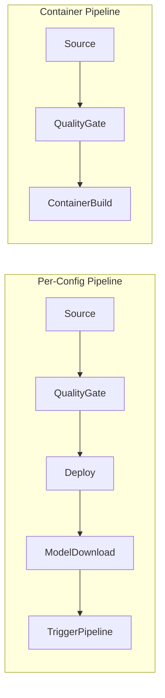

> **Navigation:** [← Main README](../../README.md) | [Operations Guide](../../docs/OPERATIONS.md) | [infrastructure/README.md](../README.md)

# infrastructure/cicd_pipeline/

Automated CI/CD deployment system. Creates one independent CodePipeline per pipeline config, plus a dedicated container build pipeline shared across all configs.

---

## Process Flow

When a change is pushed, each per-config pipeline runs through five stages:

**Source → QualityGate → Deploy → ModelDownloadAndUpload → TriggerPipeline**

- **Source** — picks up the S3 source asset for this pipeline config
- **QualityGate** — two parallel actions: `LintAndSynth` (pre-commit hooks + `cdk synth`) and `Test` (pytest with per-config marker expressions)
- **Deploy** — adaptive CDK deployment strategy (combined deploy for first-time/new-stack, two-phase deploy for updates to avoid CloudFormation export conflicts)
- **ModelDownloadAndUpload** — downloads model weights and syncs sample input data to S3
- **TriggerPipeline** — invokes the pipeline trigger Lambda to start the SageMaker Pipeline execution

Container image builds run in a separate pipeline (Source → QualityGate → ContainerBuild) and are not part of the per-config flow.

---

## Key Concepts

### Per-Config Isolation

Each pipeline config YAML in `cicd.yaml` `pipeline_configs` gets its own independent CodePipeline. Deploying or updating one config does not affect the others — you can iterate on a single pipeline without triggering rebuilds for unrelated configs.

### Source Asset Hashing

Each pipeline's S3 source asset has a content hash covering shared directories (`infrastructure/`, `project_constructs/`, `app.py`, `lambdas/`, `tests/`, `schema/`, `config/config.py`, `config/cicd/`, `config/retrieval/`) plus that pipeline's own config file. Changing one config only triggers that pipeline. Changes to shared directories trigger all pipelines.

### Container Build Pipeline

A dedicated `ContainerPipelineStack` builds ALL container images across all configs in one place. It collects the deduplicated set of containers and runs one parallel CodeBuild action per unique container. Its source hash covers `processing_job/` and `schema/`, so it only triggers when container source code changes.

Each build computes a content hash from the step directory and skips the Docker build/push when a cached image with the same hash already exists in ECR.

### Adaptive Deploy Strategy

The Deploy stage detects the current state of CloudFormation stacks at runtime and picks the right strategy:

- **First-time / new stack** — deploys all stacks together so CDK resolves cross-stack dependencies in a single pass
- **Update** — two-phase deployment to avoid CloudFormation export conflicts (Phase 1: consumer stacks, Phase 2: all per-config stacks)

---

## Module Overview

| Module | Role |
|---|---|
| `stack.py` | `CiCdPipelineStack` — per-config CodePipeline orchestration |
| `container_stack.py` | `ContainerPipelineStack` — dedicated container build pipeline |
| `container_pipeline.py` | Factory that assembles the container build pipeline |
| `buildspecs.py` | CodeBuild buildspec generators for each stage (lint, test, deploy, model download, container step build) |
| `deploy_script.py` | Adaptive deploy strategy (first-time vs two-phase) |
| `resolve_stacks.py` | Runtime stack name resolution and strategy detection |
| `helpers.py` | Shared CodeBuild project factory and container collection |
| `codebuild_stack.py` | ECR + CodeBuild project creation for container images |
| `policies.py` | Least-privilege IAM policy builders per stage |
